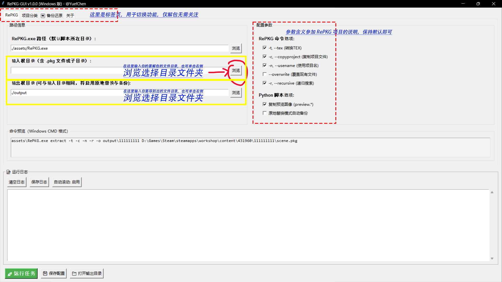
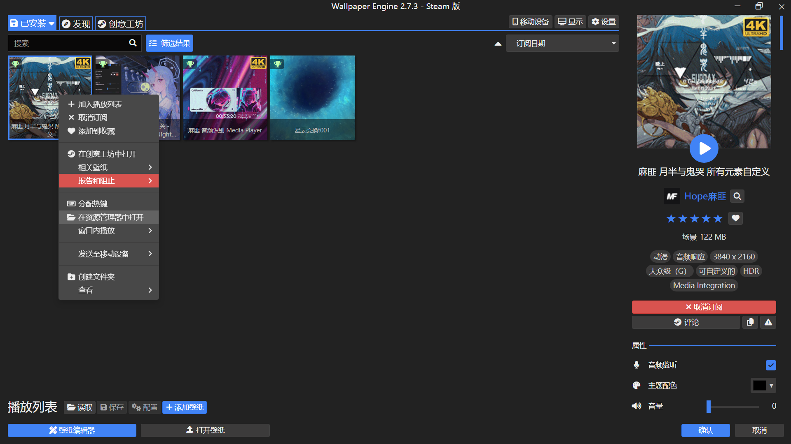
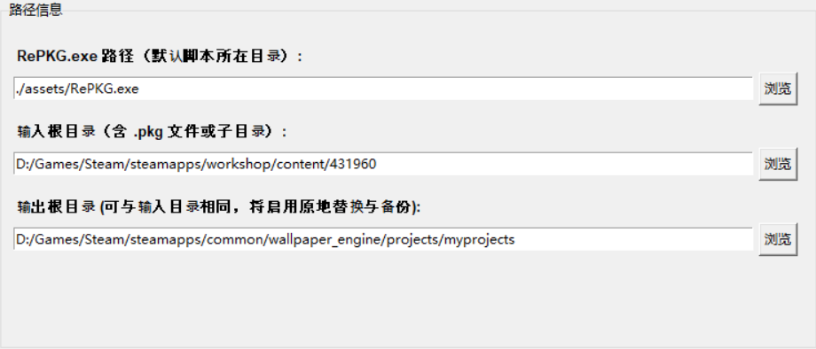
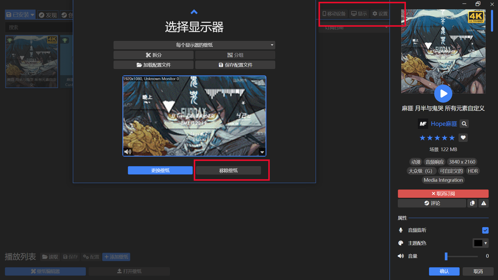
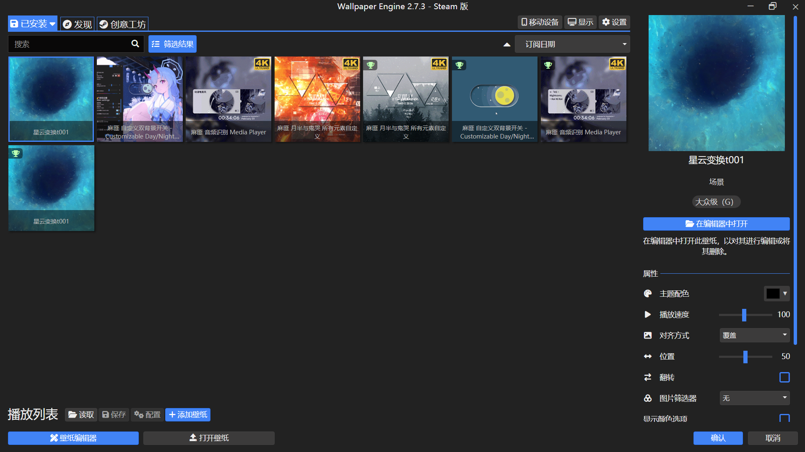
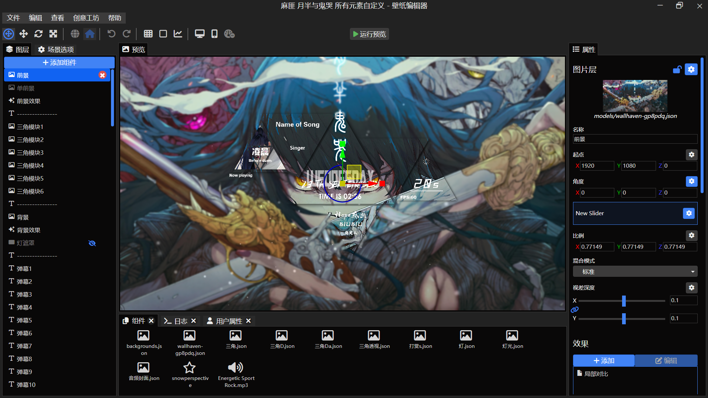

# 🎨 RePKG-GUI 工具 ｜ Wallpaper Engine 项目转换器

> **RePKG-GUI Tool — Wallpaper Engine Project Converter**

---

## 🧩 项目简介 | Overview

**RePKG-GUI** 为 [RePKG.exe](https://github.com/notscuffed/RePKG) 命令行工具提供了一个易用、直观的可视化界面，无需命令行操作，即可高效进行 Wallpaper Engine 创意工坊项目的**批量提取**与**项目结构转换**。

> - 可视化操作降低门槛  
> - 一键完成批量任务  
> - 项目结构自动适配 Wallpaper Engine 编辑器

---

## 🚀 主要特性 | Features

| 功能              | 说明（中文）                                      | Description (EN)                                      |
|-------------------|--------------------------------------------------|-------------------------------------------------------|
| **批量提取**      | 一键处理多个 `.pkg` 文件，自动调用 RePKG 解包    | Batch extract multiple `.pkg` files via RePKG         |
| **项目转换**      | 创意工坊不可编辑 `.pkg` 文件一键变为可编辑项目   | Convert workshop packages to editable project folders  |
| **项目分类映射**  | 按类别分类项目并管理文件映射，自动适配原路径     | Classify and link/clean files for original directory structure |

---

## ⚙️ 快速上手 | Quick Start

### 1️⃣ Python 版本

#### 环境要求 Environment

- **Python ≥ 3.8** （建议 Windows 系统）
- [RePKG.exe](https://github.com/notscuffed/RePKG) 放于 `./assets/RePKG.exe` （与脚本同目录）
- 💡 *仅依赖 Python 标准库，无需第三方依赖*

> **如果未安装 Python 或不熟悉命令行，推荐直接使用打包版 exe！**

#### 运行方式 Run

```bash
python RePKG-GUI.py
```

---

### 2️⃣ EXE 版本

- 下载 Release 版 Zip 或 Setup 安装包  
- 解压或安装后直接打开 `RePKG-GUI.exe`

---

## 🪟 操作演示 | Usage Demo

#### 1. 第一次启动需同意协议

#### 2. 填写输入/输出路径

- **输入路径**：在 Wallpaper Engine 中右键壁纸 → 在资源管理器中打开 → 选择上级目录 "431960"
- **输出路径**：建议设为本地项目路径  
  > `\Steam\steamapps\common\wallpaper_engine\projects\myprojects`

  
  


#### 3. 解包须知
> 若目标壁纸正在运行，请先于 Wallpaper Engine 右上角"显示"→移除壁纸



#### 4. 运行任务
- 点击 "运行" 按钮，等待进度完成


#### 5. 查看结果
- 打开 Wallpaper Engine，即可在本地项目中看到新壁纸  
- 支持直接“在编辑器打开”

  


> 其余实用功能请配合界面提示自行探索！

---

## 📜 开源协议 | License

本项目遵循 [MIT License](./LICENSE)。  
欢迎自由使用、修改及分发。

---

## 💬 致谢 | Acknowledgements

- [RePKG](https://github.com/notscuffed/RePKG) —— 原始解包工具

